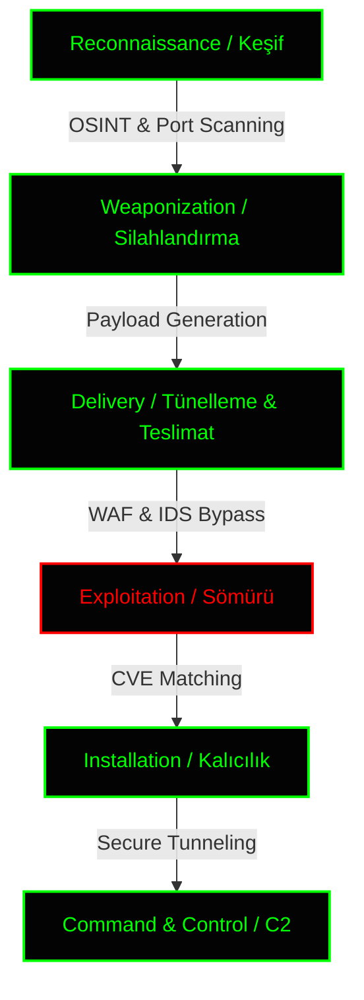

<div align="center">
  <!-- HACKER ANIMASYONLU GİRİŞ (CYBERPUNK BANNER) -->
  

  <br><br>

  <!-- LED DAKTİLO EFEKTİ (EMİR UYGULANDI: GÜVENLİK DUVARLARI İPTAL) -->
  <a href="https://github.com/Pireburak">
    
  </a>

  <br>

  <!-- CASUS ZİYARETÇİ SAYACI (KIRMIZI ALARM) -->
  <p align="center">
    <a href="https://github.com/Pireburak">
      
    </a>
  </p>
</div>

---

<br>

### ⚠️ `> SYSTEM_ALERT: RESTRICTED_ZONE`
```console
[!] ALERT: You have entered a restricted Red Team development environment.
[!] STATUS: All firewalls have been disabled per operator command.
[!] ACTION: Proceed with caution. Your connection is being monitored.
```

---

### 🕵️‍♂️ `> EXECUTE: ./whoami --verbose`

```json
{
  "operator": {
    "alias": "Pireburak",
    "status": "Online & Listening 🟢",
    "clearance_level": "Root / UID 0",
    "primary_objective": "Architecting unbreakable systems & offensive recon tools."
  },
  "expertise_matrix": {
    "reconnaissance": "Advanced Port Scanning, Service Fingerprinting, OSINT",
    "backend_arch": "Asynchronous Python, FastAPI, SQLite",
    "evasion_tactics": "CORS Bypass, WAF Stealth, Cloudflare Tunneling",
    "threat_intel": "CVE Analysis, AI Risk Scoring, Threat Modeling"
  },
  "current_operation": "Deploying 'ReconClaw v4.0 Ultimate' - The apex predator of network scanners.",
  "philosophy": "A firewall is just a puzzle waiting to be solved. If you can't break it, you can't secure it."
}
```

---

### ⚔️ `> LOAD_ARSENAL: --tech-stack`

*Sistem mimarisi inşa ederken ve ağ güvenlik duvarlarını delerken güvendiğim çekirdek teknolojiler:*

<div align="center">
  <p><strong>[ 0x01: OFFENSIVE SECURITY & OPS ]</strong></p>
  
  
  
  

  <br><br>

  <p><strong>[ 0x02: BACKEND & CORE LOGIC ]</strong></p>
  
  
  
  

  <br><br>

  <p><strong>[ 0x03: NETWORK & TUNNELING ]</strong></p>
  
  
  
  
  
  <br><br>

  <p><strong>[ 0x04: FRONTEND INJECTION ]</strong></p>
  
  
  
</div>

---

### 🦅 `> PING_PROJECT: ReconClaw_v4.0`

#### 🚨 [ReconClaw v4.0 Ultimate (Matrix Edition)](https://github.com/Pireburak/ReconClaw)
> **Advanced Network Port Scanner & AI Threat Intelligence Platform**

Sıradan tarayıcıları unutun. WAF sistemlerini ve tarayıcı güvenlik duvarlarını (Chrome/CORS) atlatmak için sıfırdan tasarlanmış devasa bir siber istihbarat aracı.

- ⚡ **Asynchronous Socket Engine:** Python `asyncio` ile binlerce portu dondurmadan saniyeler içinde tarar.
- 🧠 **AI Brain (Risk Motoru):** Servis versiyonlarını analiz eder, muhtemel **CVE** zafiyetlerini listeler ve risk skoru çıkartır.
- 🛡️ **Stealth Mode (WAF Bypass):** Cloudflare tünellerinde kopma yaşanmaması için arka planda *Endpoint Obfuscation* ve *Threadpool* mimarisi kullanır.
- 🌐 **OSINT Footprinting:** IP-API kullanarak saniyeler içinde hedefin veri merkezini, ISS bilgisini ve coğrafi konumunu saptar.
- 💻 **Terminal UI:** Tüm sistem, tek bir Python dosyası içine gömülü DOM manipülasyonlu "Matrix" arayüzü ile çalışır.

---

### 🕸️ `> TRACE_WORKFLOW: Cyber_Kill_Chain`

*Bir hedefe yaklaşırken izlediğim yapısal metodoloji (Siber Sızma Zinciri):*



---

### 📊 `> EXTRACT_DATA: Github_Analytics`

*Veri merkezimden çekilen anlık aktivite logları:*

<div align="center">
  
  
</div>

<br>

<div align="center">
  
</div>

---

### 📡 `> ESTABLISH_SECURE_CONNECTION`

Benimle yeni bir zafiyet aracı geliştirmek, ağ güvenliği mimarisi tartışmak veya siber güvenlik evreninde bağlantı kurmak istersen, aşağıdaki güvenli hatlardan bana ulaşabilirsin:

<div align="center">
  <br>
  <!-- BURAYA KENDI EMAIL VE DISCORD ADINI YAZMAYI UNUTMA -->
  <a href="mailto:seninmailadresin@gmail.com">
    
  </a>
  <a href="https://github.com/Pireburak">
    
  </a>
  <a href="#">
    
  </a>
</div>

<!-- KAPANIS EFEKTI (DALGALANAN NEON YEŞİL) -->
<div align="center">
  <br>
  <p style="color: #00ff00; font-family: 'Courier New', Courier, monospace; font-size: 14px;">[+] DISCONNECTING FROM MAINFRAME... SUCCESS.</p>
  <p style="color: #ff0000; font-family: 'Courier New', Courier, monospace; font-size: 14px;">[!] LOGS ERASED.</p>
  
</div>
