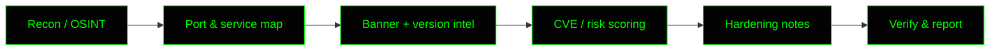

<div align="center">
  
  <a href="https://github.com/Pireburak">
    
  </a>
  <p>
    <a href="https://github.com/Pireburak">
      
    </a>
    
    
  </p>
</div>
---
### `> whoami`
Yazılım ve siber güvenlik kesişiminde çalışan bir mühendisim. Sistemleri **nasıl kırıldıklarını anlayarak** tasarıyorum: keşif, servis parmak izi, zafiyet analizi ve ardından sağlam backend mimarisi.
I build tools and backends at the intersection of **network reconnaissance** and **secure system design**. Current flagship: [ReconClaw](https://github.com/Pireburak/ReconClaw) — async scanning, banner intel, and AI-assisted risk scoring.
```json
{
  "alias": "Pireburak",
  "role": "Security-minded software engineer",
  "stack": ["Python", "FastAPI", "asyncio", "SQLite", "Linux"],
  "focus": ["Network recon", "OSINT", "CVE / risk analysis", "API backends"],
  "now": "ReconClaw v4.0 — async scanner + threat intelligence UI",
  "principle": "If you can't break it, you can't secure it."
}
```
---
### `> tech --stack`
<div align="center">
  <p><strong>Security & ops</strong></p>
  
  
  
  
  <p><strong>Backend</strong></p>
  
  
  
  
  <p><strong>Infra & frontend</strong></p>
  
  
  
  
  
  
  
</div>
---
### `> featured: ReconClaw`
#### [ReconClaw v4.0](https://github.com/Pireburak/ReconClaw)
**Async network discovery, banner grabbing, and AI-assisted risk analysis.**
Yetkili keşif ve pentest iş akışı için tasarlanmış bir siber güvenlik aracı: hızlı tarama, servis istihbaratı ve risk skoru tek yerde.
| Capability | What it does |
| --- | --- |
| Async socket engine | Python `asyncio` ile çok sayıda portu UI'yı kilitlemeden tarar |
| Banner / version intel | Açık servislerden sürüm bilgisi toplar |
| Risk engine | Sürümlere göre olası CVE'leri eşler ve risk skoru üretir |
| OSINT footprint | IP-API ile loc, ASN / ISP ve veri merkezi bağlamı |
| Matrix UI | Tek dosyada gömülü terminal-tarzı arayüz |
---
### `> workflow`
Yetkili bir değerlendirmede izlediğim hat:

```mermaid
graph LR
  A[Recon / OSINT] --> B[Port & service map]
  B --> C[Banner + version intel]
  C --> D[CVE / risk scoring]
  D --> E[Hardening notes]
  E --> F[Verify & report]
  style A fill:#030303,stroke:#00ff00,color:#0f0
  style B fill:#030303,stroke:#00ff00,color:#0f0
  style C fill:#030303,stroke:#00ff00,color:#0f0
  style D fill:#030303,stroke:#00ff00,color:#0f0
  style E fill:#030303,stroke:#00ff00,color:#0f0
  style F fill:#030303,stroke:#00ff00,color:#0f0
```
---
### `> github stats`
<div align="center">
  
  
  <br />
  
</div>
---
### `> connect`
Güvenlik aracı, backend mimarisi veya iş birliği için:
<div align="center">
  <a href="mailto:burak4234@outlook.com">
    
  </a>
  
  <a href="https://github.com/Pireburak">
    
  </a>
</div>
<div align="center">
  
</div>
