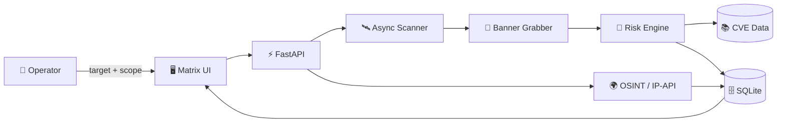
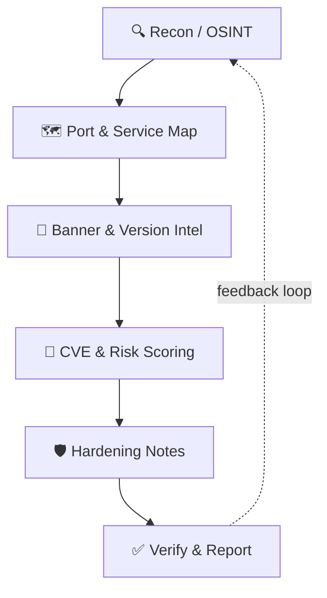

<!-- ═══════════════════════════════ HEADER ═══════════════════════════════ -->
<div align="center">


<a href="https://github.com/Pireburak">
  
</a>

<br/>


</div>


<!-- ═══════════════════════════════ WHOAMI ═══════════════════════════════ -->

## `> whoami`

```bash
┌──(pireburak㉿kali)-[~]
└─$ whoami
burak — security-minded software engineer

┌──(pireburak㉿kali)-[~]
└─$ cat about.txt
[+] Sistemleri nasıl kırıldıklarını anlayarak tasarlıyorum.
[+] Keşif → servis parmak izi → zafiyet analizi → sağlam backend mimarisi.
[+] I build tools at the intersection of network recon & secure system design.

┌──(pireburak㉿kali)-[~]
└─$ cat /etc/motto
"If you can't break it, you can't secure it."
```

<table>
<tr>
<td width="50%" valign="top">

### 🎯 Şu an
- 🛰️ **ReconClaw v4.0** — async tarayıcı + threat intel UI
- 🧠 AI destekli CVE eşleme ve risk skorlaması
- ⚡ FastAPI ile yüksek performanslı güvenlik API'leri
- 📚 Derinleşiyor: exploit analizi, ağ protokolleri

</td>
<td width="50%" valign="top">

### 🧬 Profil
```yaml
alias:     Pireburak
location:  Türkiye 🇹🇷
focus:     [Recon, OSINT, CVE, APIs]
languages: [Python, C++, Bash, JS]
os:        Kali Linux
coffee:    ████████████ 100%
```

</td>
</tr>
</table>

<!-- ═══════════════════════════════ ARSENAL ═══════════════════════════════ -->

## `> ls ~/arsenal`

<div align="center">

**⚙️ Core & Backend**


**🛡️ Security Toolkit**


**🌐 Infra & Frontend**


</div>

<!-- ═══════════════════════════════ FEATURED ═══════════════════════════════ -->

## `> ./featured --project ReconClaw`

<div align="center">
  <a href="https://github.com/Pireburak/ReconClaw">
    
  </a>
</div>

> **Async network discovery, banner grabbing & AI-assisted risk analysis.**
> Yetkili keşif ve pentest iş akışı için: hızlı tarama, servis istihbaratı ve risk skoru tek yerde.

| 🔧 Modül | 📡 Ne yapar | ⚡ Teknoloji |
| --- | --- | --- |
| **Async Socket Engine** | Binlerce portu UI kilitlemeden tarar | `asyncio` |
| **Banner / Version Intel** | Açık servislerden sürüm bilgisi toplar | `socket` + parsers |
| **Risk Engine** | Sürümleri olası CVE'lerle eşler, risk skoru üretir | AI + CVE feeds |
| **OSINT Footprint** | Konum, ASN / ISP, veri merkezi bağlamı | IP-API |
| **Matrix UI** | Tek dosyada gömülü terminal tarzı arayüz | HTML / JS |

<details>
<summary><b>🧩 ReconClaw mimarisi (tıkla)</b></summary>
<br/>


```mermaid
flowchart LR
  U[👤 Operator] -->|target + scope| UI[🖥️ Matrix UI]
  UI --> API[⚡ FastAPI]
  API --> SC[🛰️ Async Scanner]
  SC --> BG[📡 Banner Grabber]
  BG --> RE[🧠 Risk Engine]
  RE --> CVE[(📚 CVE Data)]
  API --> OS[🌍 OSINT / IP-API]
  RE --> DB[(🗄️ SQLite)]
  OS --> DB
  DB --> UI
```

</details>

<!-- ═══════════════════════════════ METHODOLOGY ═══════════════════════════════ -->

## `> cat methodology.md`

Yetkili bir değerlendirmede izlediğim hat:


```mermaid
flowchart TD
  A[🔍 Recon / OSINT] --> B[🗺️ Port & Service Map]
  B --> C[📡 Banner & Version Intel]
  C --> D[🧠 CVE & Risk Scoring]
  D --> E[🛡️ Hardening Notes]
  E --> F[✅ Verify & Report]
  F -. feedback loop .-> A
```

<details>
<summary><b>📜 Prensiplerim</b></summary>
<br/>

```diff
+ Kapsam yazılı değilse, tarama yok.
+ Her bulgu bir düzeltme önerisiyle gelir.
+ Otomasyon hız kazandırır, doğrulama güven kazandırır.
+ Güvenli varsayılanlar > sonradan yamalar.
- "Security through obscurity" bir strateji değildir.
```

</details>

<!-- ═══════════════════════════════ ROADMAP ═══════════════════════════════ -->

## `> cat roadmap.todo`

- [x] ReconClaw async engine
- [x] Banner grabbing + version detection
- [x] OSINT footprint modülü
- [ ] ReconClaw v4.0 — AI risk engine iyileştirmeleri
- [ ] Docker imajı + tek komutla kurulum
- [ ] Rapor dışa aktarma (PDF / JSON)
- [ ] Plugin sistemi (özel tarama modülleri)

<!-- ═══════════════════════════════ QUOTE ═══════════════════════════════ -->

## `> fortune | cowsay`

<div align="center">
  
</div>

<!-- ═══════════════════════════════ STATS ═══════════════════════════════ -->

## `> ./stats --verbose`

<div align="center">


</div>

<!-- ═══════════════════════════════ SNAKE ═══════════════════════════════ -->

<div align="center">
  <picture>
    <source media="(prefers-color-scheme: dark)" srcset="https://raw.githubusercontent.com/Pireburak/Pireburak/output/github-snake-dark.svg" />
    <source media="(prefers-color-scheme: light)" srcset="https://raw.githubusercontent.com/Pireburak/Pireburak/output/github-snake.svg" />
    
  </picture>
</div>

<!-- ═══════════════════════════════ CONNECT ═══════════════════════════════ -->

## `> ping pireburak`

```
PING pireburak (127.0.0.1): 56 data bytes
64 bytes from pireburak: icmp_seq=0 ttl=64 — güvenlik aracı? backend mimarisi? iş birliği?
64 bytes from pireburak: icmp_seq=1 ttl=64 — kanallar açık, yaz 👇
```

<div align="center">

<a href="mailto:burak4234@outlook.com"></a>

<a href="https://github.com/Pireburak"></a>

<br/><br/>

<sub>⚠️ Buradaki tüm araçlar yalnızca <b>yetkili</b> testler ve eğitim amaçlıdır. / For authorized testing & education only.</sub>


</div>
