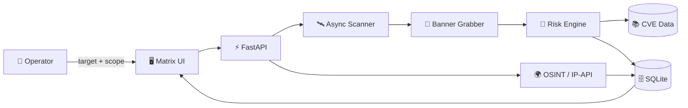

<!-- ═══════════════════════════════ BAŞLIK ═══════════════════════════════ -->
<div align="center">



<a href="https://github.com/Pireburak">
  
</a>


<a href="https://github.com/Pireburak?tab=followers"></a>
<a href="https://github.com/Pireburak?tab=repositories"></a>


</div>

<!-- ═══════════════════════════════ WHOAMI ═══════════════════════════════ -->

## `> whoami`

```bash
┌──(pireburak㉿kali)-[~]
└─$ whoami
burak — security-minded software engineer

┌──(pireburak㉿kali)-[~]
└─$ cat about.txt
[+] Sistemleri nasıl kırıldıklarını anlayarak tasarlıyorum.
[+] Keşif → servis parmak izi → zafiyet analizi → sağlam backend mimarisi.
[+] I build tools at the intersection of network recon & secure system design.
[+] Yakıt: demli çay. Menşei: Anadolu. Pusula: bilim.

┌──(pireburak㉿kali)-[~]
└─$ cat /etc/motto
"If you can't break it, you can't secure it."
```

<table>
<tr>
<td width="50%" valign="top">

### 🎯 Şu an
- 🛰️ **ReconClaw v4.0** — async tarayıcı + threat intel UI
- 🧠 AI destekli CVE eşleme ve risk skorlaması
- ⚡ FastAPI ile yüksek performanslı güvenlik API'leri
- 📚 Derinleşiyor: exploit analizi, ağ protokolleri

</td>
<td width="50%" valign="top">

### 🧬 Profil
```yaml
alias:     Pireburak
location:  Türkiye 🇹🇷
focus:     [Recon, OSINT, CVE, APIs]
languages: [Python, C++, Bash, JS]
os:        Kali Linux
çay:       ████████████ 100%
```

</td>
</tr>
</table>



<!-- ═══════════════════════════════ ATATÜRK ═══════════════════════════════ -->

## `> cat /etc/pusula`

<div align="center">
  
</div>

<!-- ═══════════════════════════════ ARSENAL ═══════════════════════════════ -->

## `> ls ~/arsenal`

<div align="center">

**⚙️ Çekirdek & Backend**


**🛡️ Güvenlik Cephaneliği**


**🌐 Altyapı & Önyüz**


</div>

<!-- ═══════════════════════════════ FEATURED ═══════════════════════════════ -->

## `> ./featured --project ReconClaw`

<div align="center">
  <a href="https://github.com/Pireburak/ReconClaw">
    
  </a>
</div>

> **Async network discovery, banner grabbing & AI-assisted risk analysis.**
> Yetkili keşif ve pentest iş akışı için: hızlı tarama, servis istihbaratı ve risk skoru tek yerde.

| 🔧 Modül | 📡 Ne yapar | ⚡ Teknoloji |
| --- | --- | --- |
| **Async Socket Engine** | Binlerce portu UI kilitlemeden tarar | `asyncio` |
| **Banner / Version Intel** | Açık servislerden sürüm bilgisi toplar | `socket` + parsers |
| **Risk Engine** | Sürümleri olası CVE'lerle eşler, risk skoru üretir | AI + CVE feeds |
| **OSINT Footprint** | Konum, ASN / ISP, veri merkezi bağlamı | IP-API |
| **Matrix UI** | Tek dosyada gömülü terminal tarzı arayüz | HTML / JS |

<details>
<summary><b>🧩 ReconClaw mimarisi (tıkla)</b></summary>
<br/>


```mermaid
flowchart LR
  U[👤 Operator] -->|target + scope| UI[🖥️ Matrix UI]
  UI --> API[⚡ FastAPI]
  API --> SC[🛰️ Async Scanner]
  SC --> BG[📡 Banner Grabber]
  BG --> RE[🧠 Risk Engine]
  RE --> CVE[(📚 CVE Data)]
  API --> OS[🌍 OSINT / IP-API]
  RE --> DB[(🗄️ SQLite)]
  OS --> DB
  DB --> UI
```

</details>

<!-- ═══════════════════════════════ İSTİKBAL GÖKLERDEDİR ═══════════════════════════════ -->

## `> ./istikbal --goklerdedir`

<div align="center">
  
</div>

TEKNOFEST'te sabahlayan takımlar, BAYKAR'ın **Bayraktar TB2**, **AKINCI** ve **KIZILELMA**'sı, "yapamazsınız" denen her şeyin Anadolu'da yapılabildiğinin kanıtı.
Benim cephem siber: gökteki her İHA'nın arkasında **şifreli bir veri bağı**, **sağlamlaştırılmış bir yer istasyonu** ve güvenli yazılmış bir kod satırı var. 🛡️✈️

<!-- ═══════════════════════════════ METHODOLOGY ═══════════════════════════════ -->

## `> cat methodology.md`

<div align="center">
  
</div>

<details>
<summary><b>📜 Prensiplerim</b></summary>
<br/>

```diff
+ Kapsam yazılı değilse, tarama yok.
+ Her bulgu bir düzeltme önerisiyle gelir.
+ Otomasyon hız kazandırır, doğrulama güven kazandırır.
+ Güvenli varsayılanlar > sonradan yamalar.
- "Security through obscurity" bir strateji değildir.
```

</details>

<!-- ═══════════════════════════════ SİBER SÖZLÜK ═══════════════════════════════ -->

## `> man siber-sozluk`

Güvenlik Türkçe de konuşulur. Terimlerin Türkçesini kullanmaya özen gösteriyorum:

<details>
<summary><b>📖 Türkçe siber güvenlik sözlüğü (tıkla)</b></summary>
<br/>

| 🇹🇷 Türkçe | 🇬🇧 English | 💬 Tek cümlede |
| --- | --- | --- |
| **Keşif** | Reconnaissance | Hedefi tanımadan hiçbir şeye dokunma. |
| **Parmak izi çıkarma** | Fingerprinting | Hangi servis, hangi sürüm, hangi işletim sistemi? |
| **Zafiyet** | Vulnerability | Sistemdeki zayıf nokta. |
| **İstismar** | Exploit | O zayıf noktayı kullanan kod ya da teknik. |
| **Sıfırıncı gün açığı** | Zero-day | Üreticinin henüz haberi olmayan zafiyet. |
| **Sızma testi** | Penetration test | İzinli saldırı, gerçek rapor. |
| **Oltalama** | Phishing | Tatlı dil, sahte link, gerçek kayıp. |
| **Fidye yazılımı** | Ransomware | Dosyalarını şifreler, fidye ister. Yedek al. |
| **Kötücül yazılım** | Malware | Adı üstünde. |
| **Kaba kuvvet saldırısı** | Brute force | Tüm kombinasyonları dene; rate limit'e takıl. |
| **Bal küpü** | Honeypot | Saldırganı oyalayan, onu izleyen tuzak sistem. |
| **Güvenlik duvarı** | Firewall | Kapıdaki bekçi. |
| **En az yetki ilkesi** | Least privilege | Gerektiği kadar yetki, fazlası değil. |

</details>

<!-- ═══════════════════════════════ TR BİLİŞİM TARİHİ ═══════════════════════════════ -->

## `> git log --oneline turkiye/bilisim`

```diff
+ (staged)  pireburak: sıradaki commit Anadolu'dan geliyor 🚀
* 2025  Siber Güvenlik Başkanlığı kuruldu · 7545 sayılı Siber Güvenlik Kanunu kabul edildi
* 2022  Bayraktar KIZILELMA ilk uçuşunu yaptı — insansız savaş uçağı çağı başladı
* 2019  Bayraktar AKINCI ilk uçuşunu yaptı
* 2018  İlk TEKNOFEST düzenlendi — milli teknoloji hamlesi sahaya indi
* 2016  6698 sayılı KVKK yürürlüğe girdi — kişisel veri artık kanunla korunuyor
* 2013  USOM (Ulusal Siber Olaylara Müdahale Merkezi) kuruldu
* 1993  12 Nisan: ODTÜ üzerinden Türkiye'nin ilk internet bağlantısı kuruldu
* 1960  Türkiye'nin ilk bilgisayarı IBM 650, Karayolları Genel Müdürlüğü'nde çalıştı
```

<details>
<summary><b>☕ <code>systemctl status cay.service</code> (tıkla)</b></summary>
<br/>

```bash
┌──(pireburak㉿kali)-[~]
└─$ systemctl status cay.service
● cay.service - Türk Çayı Demleme Servisi (Rize, çift katlı çaydanlık)
     Loaded: loaded (/etc/systemd/system/cay.service; enabled; preset: tavşan kanı)
     Active: active (demleniyor) since 07:00 +03; her gün, tatil yok
    Process: ince belli bardak · şeker opsiyonel · bardak altlığı zorunlu
     Memory: ☕ × ∞
     CGroup: /mutfak.slice/cay.service
             ├─ demlik     (üst kat)  — 15 dk demlenir, acele edilmez
             └─ çaydanlık  (alt kat)  — su hep kaynar

07:00:01 kali systemd[1]: Started Türk Çayı Demleme Servisi.
07:15:00 kali cay[1923]: [+] Demlendi. Renk kontrolü: tavşan kanı ✓
10:30:12 kali cay[1923]: [!] Bardak boş — auto-refill tetiklendi.
16:00:00 kali cay[1923]: [+] İkindi çayı + simit modu aktif. 🥯
02:14:59 kali cay[1923]: [~] Gece mesaisi: exploit analizi + son demlik.
```

</details>

<!-- ═══════════════════════════════ ATASÖZÜ ═══════════════════════════════ -->

## `> fortune tr-atasozleri`

Her gece İstanbul saatiyle bir atasözü seçilir ve bir güvenlik dersiyle yorumlanır (GitHub Actions ⚙️):

<!-- ATASOZU:START -->
```bash
┌──(pireburak㉿kali)-[~]
└─$ fortune tr-atasozleri --gun 282
📜  "Ağaç yaşken eğilir."
🛡️  └─> Güvenlik tasarım aşamasında başlar: secure by design.
```
<sub>🕰️ Son güncelleme: 09.10.2026 · İstanbul saatiyle her gece otomatik yenilenir.</sub>
<!-- ATASOZU:END -->

<!-- ═══════════════════════════════ ROADMAP ═══════════════════════════════ -->

## `> cat roadmap.todo`

- [x] ReconClaw async engine
- [x] Banner grabbing + version detection
- [x] OSINT footprint modülü
- [ ] ReconClaw v4.0 — AI risk engine iyileştirmeleri
- [ ] Docker imajı + tek komutla kurulum
- [ ] Rapor dışa aktarma (PDF / JSON)
- [ ] Plugin sistemi (özel tarama modülleri)


<!-- ═══════════════════════════════ STATS ═══════════════════════════════ -->

## `> ./stats --verbose`

<div align="center">


<sub>Tüm kartlar dış servis kullanmadan, bu repodaki <code>scripts/profil.py</code> ile her gece yeniden dokunur.</sub>

</div>

<!-- ═══════════════════════════════ CONNECT ═══════════════════════════════ -->

## `> ping pireburak`

```
PING pireburak (127.0.0.1): 56 data bytes
64 bytes from pireburak: icmp_seq=0 ttl=64 — güvenlik aracı? backend mimarisi? iş birliği?
64 bytes from pireburak: icmp_seq=1 ttl=64 — kanallar açık, bir çay söyle, yaz 👇
```

<div align="center">

<a href="mailto:burak4234@outlook.com"></a>

<a href="https://github.com/Pireburak"></a>

<br/><br/>

<sub>⚠️ Buradaki tüm araçlar yalnızca <b>yetkili</b> testler ve eğitim amaçlıdır. / For authorized testing & education only.</sub>

<br/><br/>



</div>
